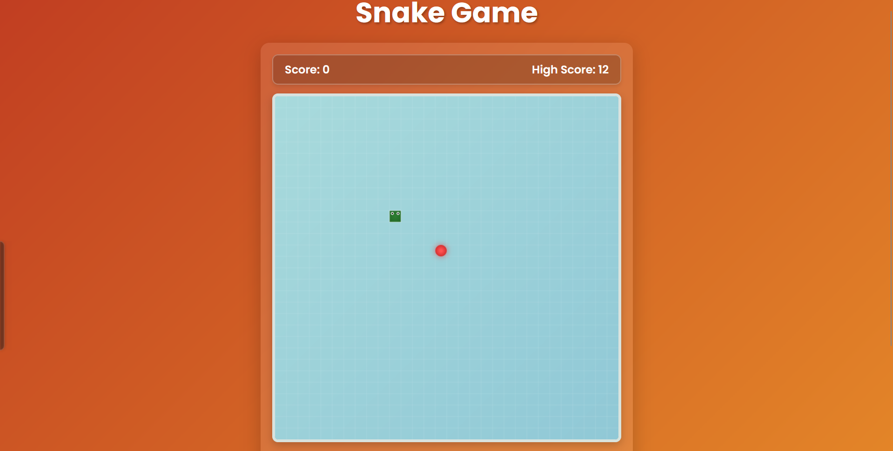

# 🐍 Snake Game

<div align="center">
  
  <h2><a href="https://sainath-666.github.io/Snake_Game_1/">Play the Game</a></h2>
</div>

## 📝 Description

A modern, responsive implementation of the classic Snake Game built with HTML5, CSS3, and JavaScript. This game features smooth animations, mobile touch controls, and a responsive design that works on all devices.

## 🎮 Features

- Responsive design that works on desktop and mobile devices
- Touch controls for mobile gameplay (swipe or use on-screen buttons)
- Keyboard controls for desktop (arrow keys)
- Increasing difficulty as your score grows
- High score tracking using local storage
- Beautiful UI with animations and visual effects
- Pause/resume functionality (press Space)

## 🕹️ How to Play

1. Use arrow keys (desktop) or swipe/touch controls (mobile) to control the snake
2. Eat the red food to grow and earn points
3. Avoid colliding with yourself
4. The game gets faster as your score increases
5. Press Space to pause/resume the game

## 💻 Technologies Used

- HTML5
- CSS3 (with animations and responsive design)
- JavaScript (ES6+)
- Canvas API for game rendering

## 🚀 Setup and Installation

1. Clone the repository:
   ```
   git clone https://github.com/sainath-666/Snake-Game.git
   ```
2. Open `index.html` in your browser
3. Start playing!

## 🔄 Future Improvements

- Multiple difficulty levels
- Special power-ups and obstacles
- Multiplayer mode
- Sound effects and background music
- Customizable snake appearance

## 📱 Mobile Support

The game is fully responsive and includes touch controls for mobile devices. You can play it on any device with a modern web browser.

## 👨‍💻 Connect with the Developer

- [GitHub](https://github.com/sainath-666)
- [LinkedIn](https://www.linkedin.com/in/sainath666)

<div align="center">
  <p>Made with ❤️ by Your Sainathreddy</p>
</div>
